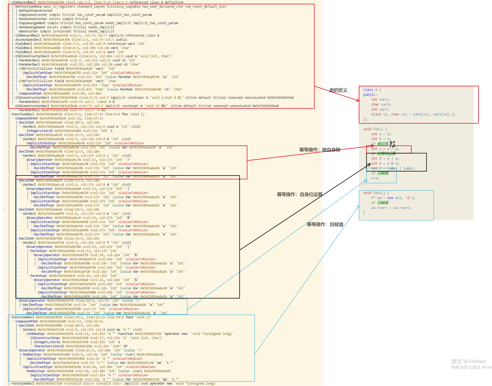
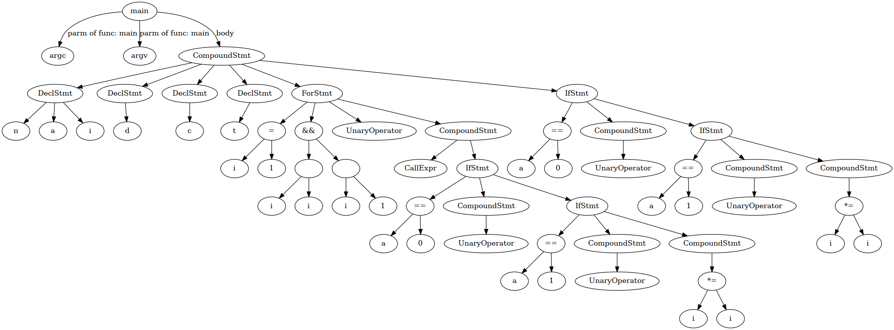
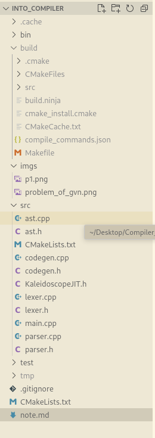

# 编译相关的(LLVM)

## 1. 幂等操作检查（C/C++代码冗余检测）

* 幂等操作主要有以下三类：
    * 自赋值
    * 被自生除
    * 自身位运算

    * 例 ：
        ```cpp
        class A { 
        public:
            int var1;
            char var2;
            int var3;
            A(int v1, char v2) : var1(v1), var2(v2) {}
        };

        void foo() {
            int a = 1;
            int b = a;
            // 被自身除
            int c = a / a;
            // 自身位运算
            int d = a | a;
            int e = a & a;
            int f = (a&a) | (a&a);
            // 自赋值
            a=a;
        }

        void foo2() {
            A* aa = new A(1, 'a');
            // 自赋值
            aa->var1 = aa->var1;
        }
        ```
### 1.1 幂等操作的AST和源代码



* AST Matcher: 用于匹配AST中的二元运算符 =（赋值）,|（或）,&（与）,/（除），这些运算符所在的表达式可能包含幂等操作（左值和右值是同一个表达式）。
    ```CPP
    clang::ast_matchers::StatementMatcher redun = binaryOperator(anyOf(hasOperatorName("="),
                                                                       hasOperatorName("|"),
                                                                       hasOperatorName("&"),
                                                                       hasOperatorName("/")), 
                                                                 hasAncestor(functionDecl().bind("function"))).bind("binOp"); 
    ```
    * hasAncestor是一个指针matcher用于去匹配parent节点（往上找），里面的参数functionDecl()去匹配函数声明节点，即用于找到表达式存在那个函数里
    * anyOf()相当于或操作
    * hasOperatorName()用于匹配操作符的名字
    * bind()将节点绑定到字符串上，用于在回调函数中通过字符串来获得ast节点，bind()只能用于节点类型的matcher
* 检测方法
    1. 通过ast matcher匹配到赋值、除、与和或表达式
    2. 将运算符的左值和右值分别提取到lhsStr和rhsStr
    3. 比较rhsStr和lhsStr，若rhsStr与lhsStr相等报告存在幂等操作

* matcher回调函数：
    ```cpp
    void IdempotentMatcher::run(const MatchFinder::MatchResult &Result) {
        // 从绑定的字符串获得ast节点
        const BinaryOperator* binaryop = Result.Nodes.getNodeAs<BinaryOperator>("binOp");
        const FunctionDecl* funcdecl = Result.Nodes.getNodeAs<FunctionDecl>("function");

        if(binaryop && funcdecl) {
            //获得binary operator的左值和右值
            const Expr* lhs = binaryop->getLHS();
            const Expr* rhs = binaryop->getRHS();
            // 左值和右值均存在
            if(lhs && rhs) {
                cout << "Find binary operator which has both left hand side and right hand side." << "\n";
                cout << "In function : " <<  funcdecl->getNameAsString() << "\n";
                cout << "Operator: " << "\n";
                //binaryop->dumpColor();           // dump ast片段
                cout << "Operating code is " << binaryop->getOpcodeStr().str() << endl;
                cout << "The left hand side : " << "\n";
                //lhs->dumpColor();
                cout << "The right hand side : " << "\n";
                lhs->dumpColor();
                //rhs->dump();
                cout << "---------------------------------------------" << "\n\n";
                // 将左值表达式以字符串的形式存到 lhsStr
                string lhsStr;
                llvm::raw_string_ostream lhsStream(lhsStr);
                PrintingPolicy Policy(Result.Context->getLangOpts());
                lhs->printPretty(lhsStream, nullptr, Policy);
                cout << lhsStr << "\n";
                // 将右值表达式以字符串的形式存到 rhsStr
                string rhsStr;
                llvm::raw_string_ostream rhsStream(rhsStr);
                lhs->printPretty(rhsStream, nullptr, Policy);
                cout << rhsStr << "\n";

                cout << "__________________ChECK_______________________" << "\n";
                // 比较左值和右值
                if(rhsStr == lhsStr) {
                    cout << "存在冗余存在： 幂等操作" << "\n" ;
                }
                cout << "\n\n=============================================\n\n";
            }
        }
    }
    ```
* 《冗余代码及相关缺陷研究》中也是通过比较左值和右值的表达式来判断的，但是左值和右值可能是由不同路径的计算出来，然后保存在不同的变量里，展开后可能是同一个表达式，如果在计算的路径中途变量没有被重新赋值，也可以判定为幂等操作。在通过CFG来分析会更方便。

## 2. 死代码检查（C/C++冗余代码检测）
由于逻辑错误导致有些代码永远无法执行到

* 死代码example
```cpp
void _dead_code_1_() {
    int v = 0, u = 1;
    for(int i=0; i<5; i++) {
        if(u>0) {
            u=0;
            break;
            // dead code
            u++;
            v++;
            u = u+v;
        } else {
            u=0;
            break;
            // dead code
            u++;
        }
        // dead code
        v++;
        u++;
        u = u+v;
    }
}

int main() {
    _dead_code_1_();
    
    return 0;
}
```
* 死代码的ast的结构：
```
-ForStmt
 |-DeclStmt
 |
 |-BinaryOperator
 |
 |-UnaryOperator
 |
 |-CompoundStmt
  \
    |-IfStmt
    |   |
    |   |-BinaryOperator
    |   |- ...
    |   |
    |   |-CompoundStmt  --> if后的代码块的根节点
    |   |   |
    |   |   |-...
    |   |   |-BreakStmt --> break语句导致之后的代码都没有机会被执行到
    |   |   |-...      --> dead code
    |   |
    |   \
    |    -CompoundStmt --> else后的代码块的根节点
    |       |
    |       |-...
    |       |-BreakStmt --> break语句导致之后的代码都没有机会被执行到
    |       |-...      --> dead code 
    |
    |
    \
     -...   -->dead code,if和else的代码块中均包含跳转语句break，必定在前面的某一个分支中跳出循环，即IfStmt后的兄弟节点均无法执行到，即为死代码
```
* ast matcher：根据对死代码ast结构的分析，以下为匹配该结构的matcher
    ```cpp
    clang::ast_matchers::StatementMatcher deadCode = forStmt(
                                                    hasBody(            // for循环后跟的代码块
                                                        hasDescendant(  // 遍历 matcher，匹配当前 ast 节点的后代
                                                            ifStmt(     // 匹配 ifStmt
                                                                hasDescendant(
                                                                    breakStmt().bind("break1")  // 匹配 if 中 break node
                                                                ),
                                                                hasElse(    // 匹配是否有else
                                                                    hasDescendant(
                                                                        breakStmt().bind("break2") // 匹配 else 中的 break node
                                                                    )
                                                                )
                                                            ).bind("ifStmt")    
                                                        )
                                                    )
                                            ).bind("forloop")；
    ```
* 死代码检测：
    1. 通过ast matcher 来匹配到可能存在死代码的结构
    2. 对forStmt的子节点进行遍历
        1. 找到IfStmt
        2. IfStmt后还存在代码
        3. 将IfStmt之后的所有代码报告为死代码
    3. 对匹配到的if和else后的代码块进行遍历
        1. 找到breakStmt
        2. 润breakStmt后还存在代码，将breakStmt后的所有代码报告为死代码

* matcher回调函数
    * clang ast的子节点是用容器存着的，可以用迭代器遍历子节点（迭代器的用法类似指针和数组）
    * 通过遍历子节点查找感兴趣的节点（if-else两个分支中都含有break的ifStmt节点，和breakStmt），通过迭代器相减来获得感兴趣的节点的下一个节点的位置
    * 通过迭代器的运算来获得死代码节点，然后遍历下去
    ```cpp
    // run function
    void deadCodeMatcher::run(const MatchFinder::MatchResult &Result) {
        // const BreakStmt *break1 = Result.Nodes.getNodeAs<BreakStmt>("break1");
        // const Stmt *break2 = Result.Nodes.getNodeAs<Stmt>("break2");
        const IfStmt *if_statement = Result.Nodes.getNodeAs<IfStmt>("ifStmt");
        const ForStmt *forloop = Result.Nodes.getNodeAs<ForStmt>("forloop");
        //获得for后面的代码块的根节点
        const Stmt* forbody = forloop->getBody();
        //forbody->dumpColor();、
        // 判断代码块的类型是否为CompoundStmt
        if(isa<CompoundStmt>(forbody)){
            // 类型转换
            const CompoundStmt* body = cast<CompoundStmt>(forbody);
            // 获得所有子节点的
            clang::CompoundStmt::body_const_range nodes = body->body();

            auto const *node = nodes.begin();
            unsigned idx = 0;

            //确定 IfStmt的位置
            for(; node!=nodes.end(); node++){
                if(isa<IfStmt>(*node)){
                    idx = node - nodes.begin() + 1;
                    break;
                }
            }
            cout << "idx is : " << idx << "\n";
            // 遍历 IfStmt后的 ast 节点并输出报告为死代码
            for( node = nodes.begin()+idx ; node!=nodes.end(); node++) {
                cout << "+++++++++++++++++++++++++\n";
                cout << "node : \n";
                (*node)->dumpColor();
                cout << "is dead code.\n";
                cout << "+++++++++++++++++++++++++\n";
            }
        }
        //遍历 if后的代码块
        const Stmt* ifbody = if_statement->getThen();
        if(isa<CompoundStmt>(ifbody)) {
            const CompoundStmt* body = cast<CompoundStmt>(ifbody);
            dead_code_after_break_stmt(body);
        }
        //遍历 else后的代码块
        const Stmt* gelse = if_statement->getElse();
        if(isa<CompoundStmt>(gelse)) {
            const CompoundStmt* ebody = cast<CompoundStmt>(gelse);
            dead_code_after_break_stmt(ebody);
        }
    }
    // 遍历子节点，找到 breakStmt，输出死代码节点
    void deadCodeMatcher::dead_code_after_break_stmt(const CompoundStmt *body) {
        clang::CompoundStmt::body_const_range nodes = body->body();
        unsigned idx=0;     //用于记录偏移
        for(auto const *node = nodes.begin(); node != nodes.end(); node++) {
            if(isa<BreakStmt>(*node)) {
                idx = node - nodes.begin() + 1;
                break;
            }
        }
        for(auto const *node = nodes.begin()+idx; node != nodes.end(); node++) {
            cout << "====================dead code after break node====================\n";
            cout << "node : \n";
            (*node)->dumpColor();
            cout << "==================================================================\n";
        }
    }
    ```

---

## 3. 使用ASTMatcher提取AST和用graphviz画AST

### Extract AST info 代码
* 用AST_Matcher去匹配有函数体的函数（即函数的定义，而不是函数的声明）
``` c++
DeclarationMatcher functions = functionDecl(hasBody(compoundStmt().bind("body"))).bind("func");
```
* ExtractHandler是我自己写的一个类，继承自匹配器（ast_matcher::MatchFinder）的回调方法
```c++
class ExtractHandler : public ast_matchers::MatchFinder::MatchCallback 
```
* 使用clang ASTMatcher匹配出代码中的带有函数实现的AST结点，将匹配到的AST的根节点绑定到字符串上
* 当ASTMatcher匹配到符合的AST结构（既带有函数体的函数）时，ASTMatcher会调用一个方法
  * ```cpp
      virtual void run(const ast_matchers::MatchFinder::MatchResult& Result);
    ```
* ASTMAtcher会匹配到一堆符和上面我们自定义的节点，每匹配到一次就执行一次run方法
  * Result 是保存匹配结果的一个数据结构，里面有绑定的节点和ASTContext（上下文信息，像代码所在的行号、列号这样的信息）
  * 像这样在run方法中通过绑定的字符串来得到matcher匹配到的节点
  * ```cpp
      const FunctionDecl *function = Result.Nodes.getNodeAs<FunctionDecl>("func");
    ```
  * 在run方法里我做了：
    1. 将匹配到的节点拿出来
    2. 将ASTContext保存到类中
    3. 判断function是否有函数体
    4. 有函数体的话
      4.1. 分析函数
      4.2. 分析body
    5. 将分析结果用dot渲染成png，并且将dot的源码写保存下来
    * 代码：
        ```cpp
        void ExtractHandler::run(const ast_matchers::MatchFinder::MatchResult& Result){
            const FunctionDecl *function = Result.Nodes.getNodeAs<FunctionDecl>("func");
            const CompoundStmt *comp = Result.Nodes.getNodeAs<CompoundStmt>("body");

            this->Context = Result.Context;

            if(function->hasBody()) {
                gvc = gvContext();
                g = agopen((char*)function->getNameAsString().c_str(), Agdirected, NULL);
                parse_function(function);
                //function->getID();
                //function->dump();

                Stmt* body = function->getBody();
                parse_body(body, function);
            //====================== to generate png and dot files ======================
                    std::string file_name = output_path + "/dotfiles/" 
                                            + function->getNameAsString() 
                                            + ".dot";
                    // Render the graph to PNG format
                    to_png(gvc, g, output_path + "/images/" +
                        function->getNameAsString() + ".png");
                    
                    // Write to dot file
                    write_to_dot(output_path + "/dotfiles/" + 
                                function->getNameAsString() + ".dot" , g);

                    free_graph_Contex(gvc, g);
                }
        }
        ```
  
---
下面是ExtractHandler里的一些用于遍历AST和提取信息方法
#### 检查是否是叶子结点
*  ```cpp
    static bool is_Leaf(Stmt* s);
    ```
* 检查语句有没有子的Stmt(像IfStmt条件后面跟的代码块那样{...})。

#### parse_function 分析函数
* 这个方法用于分析函数的类型，函数名和函数的形式参数
  ```cpp
    void ExtractHandler::parse_function(const FunctionDecl *function) {
        std::string return_type = function->getDeclaredReturnType().getAsString();
        Agnode_t *func_root_node = set_node(g, std::to_string(function->getID()), function->getNameAsString());
        // 获取function的parameter
        for(ParmVarDecl* param : function->parameters()) {
            std::string parm_type = param->getType().getAsString();

            Agnode_t* param_node = set_node(g, std::to_string(param->getID()), param->getNameAsString());

            draw_edge(g, func_root_node, param_node, 
                    "parameter", 
                        "parm of func: "+function->getNameAsString());
        }
    }
  ```
#### parse_body 分析函数体
* 对匹配到的函数的函数体继续分析
1. 函数体的根节点是一个compoundStmt类型的节点，先画一条边和function node连上
2. 调用gen_graph_bfs方法，将compoundStmt传递给gen_graph_bfs


#### 调用gen_graph_bfs方法 
* 采用宽度优先便利的方法遍历整个函数的AST
1. parse_body方法将compoundStmt塞进队列里开始bfs
2. 用isa<Type>()方法判断队列里的Stmt节点的具体类型，然后调用具体的分析函数进行处理
* 具体类型的分析函数如下（只写了binaryOperator、ForStmt、IfStmt的）
* the code :
    ```cpp
        /// bfs AST (层次遍历)
        /// 传入的参数为match到的function的body的root，namely CompoundStmt
        void ExtractHandler::gen_graph_bfs(Stmt *s) {

            std::queue<Stmt*> seq;
            seq.push(s);
            int depth=0;

            while(!seq.empty()) {
                unsigned n = seq.size();

                for(unsigned i = 0; i<n; i++) {
                    Stmt* node = seq.front();
                    seq.pop();
                    // 遍历到CompoundStmt
                    if(CompoundStmt* cst = dyn_cast<CompoundStmt>(node)) {
                        clang::CompoundStmt::body_const_range child = cst->body();

                        for(auto cd = child.begin() ;
                                    cd != child.end() ;
                                    cd++) {
                            if(!is_Leaf(*cd)) {
                                seq.push(*cd);
                                add_edge(node, *cd);
                            } else {
                                add_edge(node, *cd);
                            if(DeclStmt *ds = dyn_cast<DeclStmt>(*cd)) {
                                    parse_DeclStmt(ds);
                                }
                            }
                        }
                    }
                    // 解析forstmt
                    if(ForStmt* fors = dyn_cast<ForStmt>(node)) {
                        std::vector<Stmt*> fs = parse_ForStmt(fors);
                        for(Stmt* s : fs) {
                            seq.push(s);
                        }
                    }

                    // parse while statement
                    if(WhileStmt* ws = dyn_cast<WhileStmt>(node)) {
                        std::vector<Stmt*> wss = parse_WhileStmt(ws);
                        for(Stmt* s : wss) {
                            seq.push(s);
                        }
                    }

                    // 解析declstmt
                    if(DeclStmt *ds = dyn_cast<DeclStmt>(node)) {
                        parse_DeclStmt(ds);
                    }

                    // 解析BinaryOperator
                    if(BinaryOperator* bop = dyn_cast<BinaryOperator>(node)) {

                        parse_binaryOperator(bop);
                    }

                    // 解析IfStmt
                    if(IfStmt* is = dyn_cast<IfStmt>(node)) {
                        std::vector<Stmt*> nis = parse_IfStmt(is);
                        for(Stmt* s : nis) {
                            seq.push(s);
                        }
                    }
                    
                    // parse switch_case stmt
                    if(SwitchStmt* sc = dyn_cast<SwitchStmt>(node)) {
                        for(Stmt* s : parse_Switch(sc)) {
                            seq.push(s);
                        }
                    }
                    ...
                }
            }
        }
    ```

#### parse BinaryOperator 分析二元运算符
1. 将binaryOperator两边的Expr和Operator提取出来，
2. 分析left handside 和 right hand side ，我写了个lambda函数，用来提取token（lhs和rhs节点该给什么名字，这个其实可以直接把expr放回队列，然后在类里写一个具体类型的分析函数，这样分析代码更加好些，不会写的很大）


#### parse ForStmt 分析for循环
* 把for的结构提取出来
* 代码块直接用一个vector返回，然后在gen_graph_bfs把vector中的所有内容入队


#### parse IfStmt 分析If语句
* IfStmt的处理方法与For的差不多
* 像If-elseif-elseif...-else这样有很多else if的处理方式：
  * 使用一个while判断getElse()方法来获得Else让后判断是不是IfStmt，不是IfStmt的话停止循环
* 代码：
    ```cpp
        /*
    * The if Statement
    if
    |---cond
    |---body
    |---|
        |-then(else if) 
            |---cond
            |---body
            |---then
                |--...

    此处nextIf是只有nextIf更新后才是真的nextIf
    */
    std::vector<Stmt*> ExtractHandler::parse_IfStmt(IfStmt* is) {
        Stmt* nextIf = is;
        std::vector<Stmt*> res;
        
        while(IfStmt* nifs = dyn_cast<IfStmt>(nextIf)) {
            
            Stmt* cond = nifs->getCond();
            Stmt* then = nifs->getThen();

            add_edge(nextIf, cond);
            add_edge(nextIf, then);
            add_edge(nextIf, nifs->getElse());
            nextIf = nifs->getElse();

            res.push_back(cond);
            res.push_back(then);
            res.push_back(nextIf);
        }

        return res;
    }
    ```

* 此外我自己对Graphviz提供对函数做了一些包装，使我在ExtractHandler上用得更简单一点

### 结果
* src
    ```cpp
    int main(int argc, char** argv) {
        int n, a, i;
        long long int d;
        char c = 'a';
        int t = Factor(1, 2);
        
        //scanf("%d", &n);
        for(i=1; i <= n && i>=1; i++) {
            //scanf("%d",&a);
            //printf("%d\n", Factor(a,2));
            Factor(a+i, 2);
            if(a==0) {
                i++;
            }else if(a==1) {
                i--;
            } else {
                i *= d;
            }
        }

        if(a==0) {
            i++;
        }else if(a==1) {
            i--;
        } else {
            i *= d;
        }
    }
    ```
* graph



## 4. 简易编译器（llvm的kalediscope）
* 根据llvm的kalediscope实现的，我按照词法分析、语法分析和中间代码生成等步骤作了一些模块化。然后用cmake来构建（kalediscope的文档理是直接用命令行上用clang++和llvm-config这些方法来编译的）。
* 结构：
  
    

### CMake
* cmake的最小版本要求、项目名、可执行文件的输出路径和c++的标准和一些编译参数的设置
```cmake
cmake_minimum_required(VERSION 3.22.1)

project(kaleidoscope)

set(EXECUTABLE_OUTPUT_PATH ${PROJECT_SOURCE_DIR}/bin)

set(CMAKE_BUILD_TYPE "Debug")
SET(CMAKE_CXX_FLAGS_DEBUG "$ENV{CXXFLAGS} -O0 -Wall -g2 -ggdb") # 定义Debug编译参数
SET(CMAKE_CXX_FLAGS_RELEASE "$ENV{CXXFLAGS} -O3 -Wall") # 定义Release编译参数

set(CMAKE_CXX_STANDARD 14 CACHE STRING "")
```

* 指定特点的llvm的路径（装的llvm版本有点多，之前用apt装过，这里用我自己编译的llvm-13的版本）
```cmake
set(LT_LLVM_INSTALL_DIR "" CACHE PATH "/usr/local/llvm-13")
set(LT_LLVM_CMAKE_CONFIG_DIR "${LT_LLVM_INSTALL_DIR}/lib/cmake/llvm")
set(LT_CLANG_CMAKE_CONFIG_DIR "${LT_LLVM_INSTALL_DIR}/lib/cmake/clang")

set(search_paths "/usr/local/llvm-13/lib/cmake/clang")

set(CMAKE_EXPORT_COMPILE_COMMANDS ON)

list(APPEND CMAKE_PREFIX_PATH "${LT_LLVM_CMAKE_CONFIG_DIR}")
list(APPEND CMAKE_PREFIX_PATH "${LT_CLANG_CMAKE_CONFIG_DIR}")

find_package(LLVM 13.0.0 PATHS "/usr/local/llvm-13/lib/cmake/llvm" REQUIRED CONFIG NO_DEFAULT_PATH)
find_package(Clang PATHS "/usr/local/llvm-13/lib/cmake/clang" CONFIG NO_DEFAULT_PATH )

link_directories("/usr/local/llvm-13/lib")
```
* 设置源代码的路径和输出路径，检查
```cmake
set(CMAKE_SOURCE_DIR "src/")

# Use LLVM
add_definitions(${LLVM_DIFINITIONS})
include_directories(SYSTEM ${LLVM_INCLUDE_DIRS})
llvm_map_components_to_libnames(llvm_libs Core)

if(NOT LLVM_ENABLE_RTTI)
    set(CMAKE_CXX_FLAGS "${CMAKE_CXX_FLAGS} -fno-rtti -export-dynamic")
endif()

add_subdirectory("src")
```

### 词法分析
* lexer.h：头文件，定义token和对gettok函数进行声明
    ```cpp
    #ifndef __LEXER_H__
    #define __LEXER_H__

    #include <string>

    enum Token {
    tok_eof = -1,
    // commands
    tok_def = -2,
    tok_extern = -3,
    // primary
    tok_identifier = -4,
    tok_number = -5,
    // control
    tok_if = -6,
    tok_then = -7,
    tok_else = -8,
    tok_for = -9,
    tok_in = -10,
    };
    int gettok();

    #endif
    ```
* 词法分析的攻击就是吃进去字符流，然后吐出token
* lexer.cpp
    ```cpp
    #include "lexer.h"

    //===----------------------------------------------------------------------===//
    // Lexer
    //===----------------------------------------------------------------------===//
    std::string IdentifierStr; // Filled in if tok_identifier
    double NumVal;             // Filled in if tok_number
    /// gettok - Return the next token from standard input.
    int gettok() {
        static int LastChar = ' ';

        // skip any whitespace.
        while (isspace(LastChar))
            LastChar = getchar();

        if (isalpha(LastChar)) { // identifier: [a-zA-Z][a-zA-Z0-9]*
            IdentifierStr = LastChar;
            while (isalnum((LastChar = getchar())))
                IdentifierStr += LastChar;
            // keywords
            if (IdentifierStr == "def")
            return tok_def;
            if (IdentifierStr == "extern")
            return tok_extern;
            if (IdentifierStr == "if")
            return tok_if;
            if (IdentifierStr == "then")
            return tok_then;
            if (IdentifierStr == "else")
            return tok_else;
            if (IdentifierStr == "for")
            return tok_for;
            if (IdentifierStr == "in")
            return tok_in;
            return tok_identifier;
        }

        if (isdigit(LastChar) || LastChar == '.') { // Number: [0-9.]+
            std::string NumStr;
            do {
            NumStr += LastChar;
            LastChar = getchar();
            } while (isdigit(LastChar) || LastChar == '.');

            NumVal = strtod(NumStr.c_str(), nullptr);
            return tok_number;
        }

        if (LastChar == '#') {
            // Comment until end of line.
            do
            LastChar = getchar();
            while (LastChar != EOF && LastChar != '\n' && LastChar != '\r');

            if (LastChar != EOF)
            return gettok();
        }

        // Check for end of file.  Don't eat the EOF.
        if (LastChar == EOF)
            return tok_eof;

        // Otherwise, just return the character as its ascii value.
        int ThisChar = LastChar;
        LastChar = getchar();
        return ThisChar;
    }
    ```

### AST的定义
抽象语法树就是一个数据结构,所以ast.cpp里是空的。把节点定义好，在语法分析的过程中会根据这些定义逐渐的组织出一颗树

```cpp
/// ExprAST - Base class for all expression nodes.
class ExprAST {
public:
  virtual ~ExprAST() = default;
  /// used to generate llvm ir code
  virtual Value *codegen() = 0;
};

/// NumberExprAST - Expression class for numeric literals like "1.0".
class NumberExprAST : public ExprAST {
  double Val;

public:
  NumberExprAST(double Val) : Val(Val) {}

  Value *codegen() override;
};

/// VariableExprAST - Expression class for referencing a variable, like "a".
class VariableExprAST : public ExprAST {
  std::string Name;

public:
  VariableExprAST(const std::string &Name) : Name(Name) {}
  Value *codegen() override;
};

/// BinaryExprAST - Expression class for a binary operator.
class BinaryExprAST : public ExprAST {
  char Op;
  std::unique_ptr<ExprAST> LHS, RHS;

public:
  BinaryExprAST(char Op, std::unique_ptr<ExprAST> LHS,
                std::unique_ptr<ExprAST> RHS)
      : Op(Op), LHS(std::move(LHS)), RHS(std::move(RHS)) {}
  Value *codegen() override;
};

/// CallExprAST - Expression class for function calls.
class CallExprAST : public ExprAST {
  std::string Callee;
  std::vector<std::unique_ptr<ExprAST>> Args;

public:
  CallExprAST(const std::string &Callee,
              std::vector<std::unique_ptr<ExprAST>> Args)
      : Callee(Callee), Args(std::move(Args)) {}
  Value *codegen() override;
};

class IfExprAST : public ExprAST {
  std::unique_ptr<ExprAST> Cond, Then, Else;
public : 
  IfExprAST(std::unique_ptr<ExprAST> Cond,std::unique_ptr<ExprAST> Then, std::unique_ptr<ExprAST> Else ) 
    : Cond(std::move(Cond)), Then(std::move(Then)), Else(std::move(Else)){}

  Value  *codegen() override;
};

class ForExprAST : public ExprAST {
  std::string VarName;
  std::unique_ptr<ExprAST> Start, End, Step, Body;
public:
  ForExprAST(const std::string &VarName,
             std::unique_ptr<ExprAST> Start,
             std::unique_ptr<ExprAST> End,
             std::unique_ptr<ExprAST> Step,
             std::unique_ptr<ExprAST> Body)
            : VarName(VarName), Start(std::move(Start)), End(std::move(End)), Step(std::move(Step)), Body(std::move(Body)) {}

  Value *codegen() override;
};

/// PrototypeAST - This class represents the "prototype" for a function,
/// which captures its name, and its argument names (thus implicitly the number
/// of arguments the function takes).
class PrototypeAST {
  std::string Name;
  std::vector<std::string> Args;

public:
  PrototypeAST(const std::string &Name, std::vector<std::string> Args)
      : Name(Name), Args(std::move(Args)) {}

  const std::string &getName() const { return Name; }

  Function *codegen();
};

/// FunctionAST - This class represents a function definition itself.
class FunctionAST {
  std::unique_ptr<PrototypeAST> Proto;
  std::unique_ptr<ExprAST> Body;

public:
  FunctionAST(std::unique_ptr<PrototypeAST> Proto,
              std::unique_ptr<ExprAST> Body)
      : Proto(std::move(Proto)), Body(std::move(Body)) {}
  Function *codegen();
};

```

### 语法分析
吃进去token然后递归地进行分析，在这个过程中填充AST

* parser.h
```cpp
#ifndef __PARSER_H__
#define __PARSER_H__

#include "lexer.h"
#include "ast.h"

#include <map>
#include <memory>

namespace kale {
    int GetTokPrecedence();
    int getNextToken();
    /// LogError* - These are little helper functions for error handling.
    // 这两个报错返回的其实都是nullptr
    std::unique_ptr<ExprAST> LogError(const char *Str) ;
    std::unique_ptr<PrototypeAST> LogErrorP(const char *Str);

    std::unique_ptr<ExprAST> ParseExpression();
    /// numberexpr ::= number
    std::unique_ptr<ExprAST> ParseNumberExpr();
    /// parenexpr ::= '(' expression ')'
    std::unique_ptr<ExprAST> ParseParenExpr() ;
    /// identifierexpr
    ///   ::= identifier
    ///   ::= identifier '(' expression* ')'
    std::unique_ptr<ExprAST> ParseIdentifierExpr() ;
    /// primary
    ///   ::= identifierexpr
    ///   ::= numberexpr
    ///   ::= parenexpr
    std::unique_ptr<ExprAST> ParsePrimary() ;
    /// binoprhs
    ///   ::= ('+' primary)*
    std::unique_ptr<ExprAST> ParseBinOpRHS(int ExprPrec,
                                                std::unique_ptr<ExprAST> LHS) ;
    /// expression
    ///   ::= primary binoprhs
    ///
    std::unique_ptr<ExprAST> ParseExpression() ;
    /// prototype
    ///   ::= id '(' id* ')'
    std::unique_ptr<PrototypeAST> ParsePrototype() ;
    /// definition ::= 'def' prototype expression
    std::unique_ptr<FunctionAST> ParseDefinition() ;
    /// toplevelexpr ::= expression
    std::unique_ptr<FunctionAST> ParseTopLevelExpr() ;
    /// external ::= 'extern' prototype
    std::unique_ptr<PrototypeAST> ParseExtern() ;
}
#endif
```

* 部分parser.cpp
    * 上面词法分析其实就是一个函数，在语法分析中通过调用这个函数来，通过分析词法分析返回的token来决定接下来调用哪个方法。
    * 解析函数的定义：
        1. 这个方法的调用者肯定是解析到token是def了，在整个项目中有一个全局的变量CurTok来表示当前的token。当前的token是def，调用getNextToken来更新CurTok。
        2. 调用ParsePrototype方法来解析函数的原型
        3. 如果函数体是空，就直接返回nullptr，不为空就调用ParseExpression方法，来解析函数体
        4. 解析出函数体后就通过构造函数初始化了一个FunctionAST的独占型的智能指针，否则的话就返回nullptr
        ```cpp
        /// 函数定义的语法的描述：
        /// definition ::= 'def' prototype expression
        std::unique_ptr<FunctionAST> ParseDefinition() {
        getNextToken(); // eat def.
        // then parse the prototype
        auto Proto = ParsePrototype();
        if (!Proto)
            return nullptr;

        if (auto E = ParseExpression())
            return std::make_unique<FunctionAST>(std::move(Proto), std::move(E));
        return nullptr;
        }
        ```
    * 解析函数原型：函数原型简单地描述就算函数名后面跟着一个括号，括号里是形参。形参不是用括号隔开的，是由空格隔开的
    * 解析的步骤：
        1. 先看当前的token是不是一个标识符（IdentiferStr也是一个全局变量，是标识符字符串）
        2. 不是就直接报错，是标识符的话先存到变量FnName里，然后调用getNextToken来更新当前的token
        3. 判断紧接着的token是不是左括号，不是的话直接报错
        4. 然后解析形参，一直读取token，直到不是标识符了才停止
        5. 判断紧接着的是不是右括号，不是依旧报错，是的话再更新一次token
        6. 调用函数原型的构造函数，初始化了一个PrototypeAST的unique_ptr，就是上面的ParseDefinition函数中用Proto这个变量接收的
        ```cpp
        /// 函数原型的语法描述：
        /// prototype
        ///   ::= id '(' id* ')'
        std::unique_ptr<PrototypeAST> ParsePrototype() {
        if (CurTok != tok_identifier)
            return LogErrorP("Expected function name in prototype");
        std::string FnName = IdentifierStr;

        getNextToken();

        if (CurTok != '(')
            return LogErrorP("Expected '(' in prototype");
        std::vector<std::string> ArgNames;
        while (getNextToken() == tok_identifier)
            ArgNames.push_back(IdentifierStr);
        if (CurTok != ')')
            return LogErrorP("Expected ')' in prototype");
        // success.
        getNextToken(); // eat ')'.
        return std::make_unique<PrototypeAST>(FnName, std::move(ArgNames));
        }
        ```

### LLVM IR代码生成
* 这里与llvm关系最大
* 使用LLVM的IRBuilder来创建LLVM的ir

* 函数的llvm ir生成：
  * codegen是一个纯虚函数，每个子类都要实现
  * 通过调用顶层（root AST node）的codegen方法，然后往下层层调用codegen方法直到到达叶子节点（类似于DFS遍历），遍历完整个AST后也就生成了一段完整的llvm ir。
```cpp
Function *FunctionAST::codegen() {
  // 在module里看看这个函数原型是否已经存在同名函数了
  Function *TheFunction = TheModule->getFunction(Proto->getName());
  // 函数原型的代码生成，TheFunction为空的话就表示有同名的函数，即函数名没有重复，然后就调用函数原型的codegen来生成ir
  if(!TheFunction) {
    TheFunction = Proto->codegen();
  }
  // 调用晚Proto-->codegen()，ThFunction仍然为空，这表明在Proto->codegen()的过程中有地方报错了，直接返回nullptr
  if(!TheFunction) {
    return nullptr;
  }
  // 
  if(!TheFunction->empty()) {
    return (Function*)LogErrorV("Function cannot be redefined.");
  }

  BasicBlock *BB = BasicBlock::Create(*TheContext, "entry", TheFunction);
  Builder->SetInsertPoint(BB);

  NamedValues.clear();
  for(auto &Arg : TheFunction->args()) 
    NamedValues[std::string(Arg.getName())] = &Arg; 

  if(Value *RetVal = Body->codegen()) {
    Builder->CreateRet(RetVal);

    // Validate the generated code , checking for consistency
    verifyFunction(*TheFunction);

    // Run the optimizer on the function .
    TheFPM->run(*TheFunction, *TheFAM);

    return TheFunction;
  }

  TheFunction->eraseFromParent();
  return nullptr;
}

```

* codegen.h:
```cpp
#ifndef __CODEGEN_H__
#define __CODEGEN_H__

void HandleTopLevelExpression();        // 处理顶层表达式
void HandleExtern();                    // 处理extern，外部的符号
void HandleDefinition();                // 处理函数定义
void InitializeModuleAndManagers();     // 初始化LLVM的一些全局变量，如LLVMContext， TheModule，Builder

#endif 
```